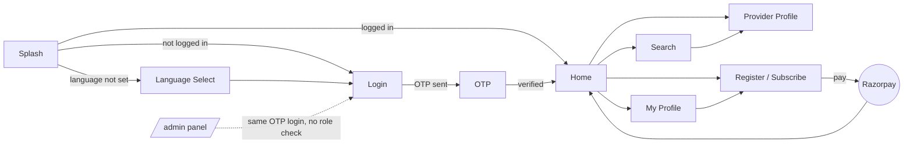

# ZYEP — Interface & Flow Audit

A walk through every screen a customer or provider sees, plus the Laravel API and Filament admin panel behind them — what each does, how they connect, and where the behavior doesn't match the intent.

**Frontend:** Angular 20, standalone components
**Backend:** Laravel 12 + Filament admin
**Scope:** full customer + provider flow, admin panel, payments
**Method:** live-tested in a local dev environment (frontend + backend running), plus a full code audit of both codebases

---

## 1. Summary

22 findings, from one that lets any signed-in customer walk into the admin panel, down to leftover dead code.

| Severity | Count |
|---|---|
| Critical | 1 |
| High | 6 |
| Medium | 6 |
| Low / cleanup | 9 |

**Where things stand:** the core booking flow (browse → search → provider → register/subscribe → pay) is genuinely built end-to-end, including a correctly-implemented Razorpay signature verification. The gaps are concentrated in two places: authorization checks that were never finished (admin access, payment ownership), and a handful of screens shipped with placeholder behavior still switched on (a fixed "4.8" rating, an unfiltered home feed when location is denied).

---

## 2. Already fixed this session

Two issues reported earlier were tracked down and corrected before this audit — noted here so they aren't re-flagged below.

- **OTP screen losing progress on app restart.** The in-progress phone number lived only in the URL, with no backup. Any full app reload (pull-to-refresh, PWA relaunch) dropped the user back at Splash, which unconditionally routed to Login. Fixed by persisting the pending phone to `sessionStorage` and having Splash and the language-selection screen resume the OTP step instead of discarding it.
- **Demo Mode not actually auto-filling the OTP.** The admin toggle promised "automatic OTP pre-filling," but the only mechanism was a manual "Quick Test Fill" button, one screen later than advertised. The OTP screen now auto-fills for real when Demo Mode is on, re-checking the live server setting rather than a cached value.

---

## 3. Screen map

---

## 4. Critical

### Any logged-in customer or provider can open the admin panel

The Filament admin login at `/admin` uses the exact same phone/OTP flow as the regular app. After OTP verification, Filament asks `User::canAccessPanel()` whether to let the user in — and that method unconditionally returns `true` for every user, with a comment reading "for now, allow everyone to access." There is no role check anywhere in the login path. Once inside, a normal customer can view every user's data, approve or reject providers, edit subscription pricing, and manually activate subscriptions.

The fix is nearly free: an `AdminMiddleware` already exists in the codebase, correctly checking `$user->role === 'admin'` — it's registered as a route-middleware alias but never actually applied anywhere. The same check just needs to land inside `canAccessPanel()`.

**References:** `app/Models/User.php:19-23`, `app/Filament/Pages/Auth/PhoneLogin.php`, `app/Http/Middleware/AdminMiddleware.php`

**Fix:** change `canAccessPanel()` to `return $this->role === 'admin';` — the role column and the middleware to reuse the same check on API routes already exist.

---

## 5. High

### A payment can be attached to someone else's provider listing

`POST /payments/order` accepts an arbitrary `provider_id` with no check that it belongs to the paying user. Combined with the "auto-approve on paid subscription" setting, a customer could pay for a package while passing another provider's ID — auto-approving that provider's listing without them ever paying.

**References:** `app/Http/Controllers/Api/PaymentController.php:29-33, 121-134`

**Fix:** verify `$provider->user_id === $request->user()->id` before creating the order.

### Payment verification doesn't confirm who the payment belongs to

`POST /payments/verify` correctly checks the Razorpay signature (this part is done right — real HMAC verification, amount trusted server-side, not client input). But it never checks that the `Payment`/`Subscription` row being activated belongs to the calling user — it's looked up purely by `order_id`. Low exploitability on its own (an attacker still needs a real, signed order/payment pair), but it's a missing defense-in-depth check on a money-adjacent endpoint.

**References:** `app/Http/Controllers/Api/PaymentController.php:80-142`

**Fix:** scope both lookups to `where('user_id', $request->user()->id)`.

### Full name, email and phone are public for every provider

`GET /api/providers` and `/api/providers/search` require no authentication and return the full nested `user` object for each result — including email address and phone number — to anyone, logged in or not. The frontend already surfaces call/SMS links straight from the search-results list, so the phone number is being deliberately shown; the email address appears to be an unintended over-fetch, and neither is gated behind login or a provider's paid visibility tier despite the app having a subscription system that could plausibly be tied to lead visibility.

**References:** `GET /api/providers`, `GET /api/providers/search`

**Fix:** return a trimmed provider resource (name/phone only, or gate email) instead of the raw model with its nested `user` relation.

### Home screen's provider list silently breaks when location is denied

The "Local Professionals" search on `/home` calls the Haversine-distance search endpoint, which *requires* `lat`/`lng`. If the user denies location access, times out, or the browser has no geolocation API, `home.ts` calls that same endpoint anyway with no coordinates — a guaranteed 422 that's silently swallowed, leaving the section permanently empty with no message and no retry. The Search screen (`/search`) handles this exact case correctly: it falls back to an unfiltered provider list and shows "Location access denied. Using general results." Home never got that fallback.

**References:** `home.ts:228-241, 298-306`; `search.ts:252-270` (reference implementation)

**Fix:** port search.ts's location-denied fallback into home.ts's `loadProviders()`.

### Every unrated provider shows a fake "4.8" trust score

The provider profile screen renders `{{ provider().rating || '4.8' }}`. Since a real rating of `0` (a provider with no reviews yet) is falsy in JavaScript, this expression shows the placeholder "4.8" as if it were a genuine trust score, indistinguishable from real data. Every brand-new, unreviewed provider currently looks identically well-rated to a provider with an actual 4.8 average.

**References:** `provider-profile.ts:73`

**Fix:** show "New" or "Not yet rated" when `rating` is `0`/`null`, rather than a fabricated number.

### "Verified Service Provider" is shown for everyone, verified or not

The profile screen's badge icon is correctly gated on `is_verified`, but the description text just below it — "Verified Service Provider in {{ locationName }}" — is unconditional and renders for every provider regardless of the actual flag, right next to a real verification system that says otherwise.

**References:** `provider-profile.ts:245`

**Fix:** gate the sentence on the same `is_verified` flag as the badge.

---

## 6. Medium

### A dead controller has a live-migration endpoint waiting to be wired up

`AdminController` is fully written but currently has zero routes pointing to it — harmless today. But its `runMigration()` method runs `artisan migrate --force` and echoes the raw output, and the codebase has no role-based route middleware applied anywhere yet. If this controller is wired up later, it inherits the same "any logged-in user" gap as the Critical finding above.

**References:** `app/Http/Controllers/Api/AdminController.php:135-149`

### Editing a provider profile silently un-approves it

`ProviderController::store` resets `status` to pending on every save — including edits to an already-approved, live listing. A provider fixing a typo in their description gets pulled from search results until an admin re-approves them. Possibly intentional (re-review on every change), but worth confirming — it currently has no visible warning to the provider that editing does this.

**References:** `app/Http/Controllers/Api/ProviderController.php:188-197`

### "One-time" subscription packages never expire

The admin panel lets a package's billing interval be set to `monthly`, `yearly`, or `one-time`. Payment verification only computes an expiry date for the first two — a one-time package silently becomes a permanent subscription. Confirm whether that's the intended behavior for that tier.

**References:** `app/Http/Controllers/Api/PaymentController.php:117-121`

### Analytics logging is a public, unthrottled write endpoint

`POST /analytics/log` requires no auth and has no rate limiting anywhere in the route group, and accepts an arbitrary-depth `metadata` object. It's a standing invitation to fill the `action_logs` table with junk.

**References:** `routes/api.php:31`

### Missing application encryption key

This environment's `.env` has `APP_KEY=` (empty). The log shows recurring `MissingAppKeyException` errors during request termination (cookie encryption). Worth a one-command fix locally, and worth double-checking the production `.env` has a real key set — this file is a separate, dev-machine copy, so it may not reflect prod, but the failure mode is easy to miss since it happens after the response is already sent.

**Fix:** `php artisan key:generate`

### Two uncoordinated "complete your profile" prompts

There's a real, backend-driven onboarding stage machine (legal → profile → location) rendered globally as a modal wizard. Separately, the Home screen has its own heuristic — "does the name look like a placeholder?" — that can independently trigger a different "Build Your Identity" prompt. Neither knows about the other, so a user can clear one and still be shown the other.

**References:** `home.ts:202-212`, `onboarding-wizard.ts`

---

## 7. Low / cleanup

Doesn't affect users today, but worth clearing out.

- Reverse-geocoding (lat/lng → address text) is independently reimplemented in five separate places (`home.ts`, `provider-profile.ts`, twice in `location-picker.ts`) instead of using the one shared `ApiService.getAddressFromCoords()` that already exists and is used correctly in the onboarding wizard.
- `home-header.ts` declares `registerClick` and `logoutClick` outputs that the parent listens for, but the header's own template never fires either one — no register or logout button exists there. Both actions only work from the Profile screen.
- `CategoryRequest` and `SearchLog` models, and `AdminController` plus `CategoryController`'s create/update/delete methods, are fully dead code — never routed or referenced anywhere in the app.
- `provider-register.ts` and `user-profile.ts` use a native `alert()` for success/error feedback, inconsistent with the custom toast used on the provider-profile screen.
- Location search is hardwired to Kerala/India (`location-picker.ts` appends ", Kerala, India" to every query and defaults the map to Kochi's coordinates) — fine if that's the current launch market, but not documented anywhere as an intentional constraint.
- `formatDistance()` is duplicated verbatim in `home-providers.ts` and `search.ts`, and both assume the backend's `distance` field is already in kilometers — worth confirming against the Haversine query's actual units.
- `PaymentService` manually reads the token from storage and sets its own `Authorization` header instead of relying on the shared HTTP interceptor every other service uses — redundant, and it won't follow if the interceptor's token handling ever changes.
- The provider-registration draft is saved to a single, unscoped `localStorage` key — on a shared or public browser, a second person continuing an abandoned registration would see the first person's half-finished draft.
- `Provider`'s mass-assignable fields include `status`, `is_verified`, and `rating`. Not currently exploitable — every controller builds its update array explicitly — but a landmine for whoever adds the next endpoint.

---

## 8. Suggested order

1. Fix `canAccessPanel()` — one line, closes the admin-access hole entirely.
2. Add the ownership checks to `PaymentController` — order creation and verification.
3. Fix the home-screen provider list's location-denied fallback (copy the pattern that already works in Search).
4. Remove the fake "4.8" rating fallback and the unconditional "Verified" text on the provider profile.
5. Trim the public providers API response so email isn't exposed to unauthenticated callers.
6. Everything else in Medium/Low, at whatever pace suits — none of it is user-facing on the happy path today.

---

*Audit covers the Angular frontend (`ZYEP-frontend`) and Laravel + Filament backend (`ZYEP`) as of this session, tested against a local dev environment. File:line references reflect the code at time of writing.*
